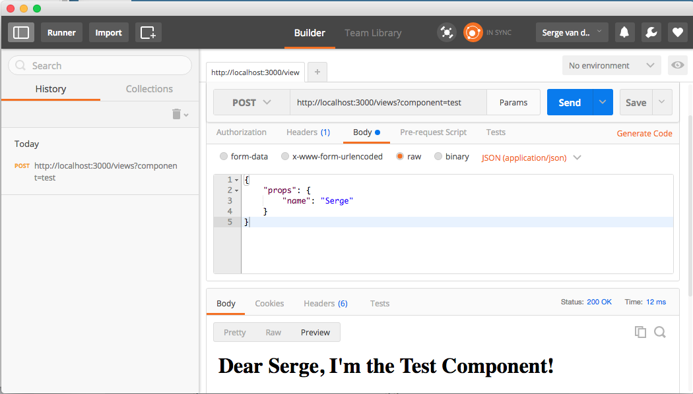

# ComponentReactor

ComponentReactor is an NodeJS express application that does universal rendering of ReactJS components.

## Installation

The easiest way to install the ComponentReactor is by cloning this repository with the command:

```git clone https://github.com/svdoever/ComponentReactor.git```

## Getting started

To get the server-side rendered version of a ReactJS component managed by ComponentReactor, start the 
ComponentReactor service by executing ```node index.js``` (or ```npm start```).

When the service is running, requests can be posted to the service over http as follows:

```curl http://localhost:3000?component=test --data "{\"props\":{\"name\":\"Serge\"}}" -H "Content-Type: application/json"```

This request results in a server-side rendered component with the following html:

```html
<h1 data-reactroot="" data-reactid="1" data-react-checksum="628833960"><!-- react-text: 2 -->Dear <!-- /react-text --><!-- react-text: 3 -->Serge<!-- /react-text --><!-- react-text: 4 -->, I&#x27;m the Test Component!<!-- /react-text --></h1>
```

Components are managed in the ```components``` folder.

## Example call to ComponentReactor from PostMan


